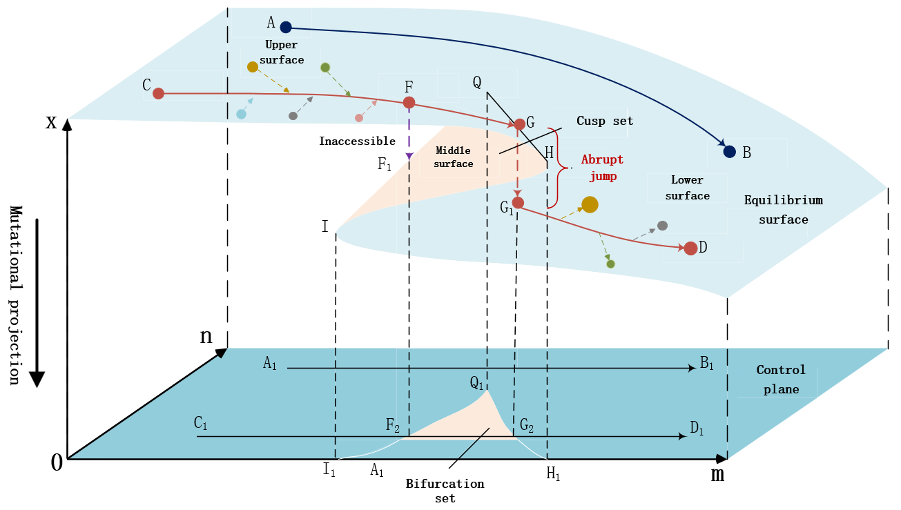

# IBID-CCT
This is the repository for the IPM 2025 paper "IBID-CCT: A Novel Model for Interdisciplinary Breakthrough Innovation Detection based on Cusp Catastrophe Theory"
## Overview
IBID-CCT: A Novel Model for Interdisciplinary Breakthrough Innovation Detection based on Cusp Catastrophe Theory. The main contributions of this paper are reflected in the following five aspects.

- A comprehensive investigation and analysis of the mechanism and typical characteristics of interdisciplinary break-
through innovation.
- A novel model, IBID-CCT, for interdisciplinary breakthrough innovation detection based on various indicators and the
cusp catastrophe theory using eight machine learning and three deep learning models.
- Evaluate IBID-CCT and compare the performance with three baselines on a dataset with 3,075 papers, 1,340,482
citations, and 44,915 references.
- IBID-CCT models built on LGBM and BERT achieve the best performance and they outperform all the baselines.
- Analyze the impact of different indicators quantitively.

## Research Overview
The following is the model of this paper. This figure provides an overview of the interdisciplinary breakthrough innovation generation process.


## Directory Tree
```
IBID-CCT                            Root directory
├─ code                             The directory where the running code is stored.
│  ├─ all.ipynb                     The code for training and evaluating the BERT model with all metrics.
│  ├─ all                           The "all" directory is used for input and output in all.ipynb.
│  │  ├─ test.csv                   The test dataset
│  │  ├─ train.csv                  The train dataset
│  │  └─ val.csv                    The val dataset
|  |
│  ├─ all-roberta.ipynb             The code for training and evaluating the RoBERTa model with all metrics.
│  ├─ all_robert                    The "all_robert" directory is used for input and output in all_robert.ipynb.
|  |
│  ├─ all_scibert.ipynb             The code for training and evaluating the SciBERT model with all metrics.
│  ├─ all_scibert                   The "all_scibert" directory is used for input and output in all_scibert.ipynb.
|  |
│  ├─ no_ex.ipynb                   The code for training and evaluating the BERT model with the metrics excluding Halo effect.
│  ├─ no_ex                         The "no_ex" directory is used for input and output in no_ex.ipynb.
|  |
│  ├─ no_ex_robert.ipynb            The code for training and evaluating the RoBERTa model with the metrics excluding Halo effect.
│  ├─ no_ex_rebert                  The "no_ex_rebert" directory is used for input and output in no_ex_rebert.ipynb.
|  |
│  ├─ no_ex_scibert.ipynb           The code for train and evaluating the SciBERT model with the metrics excluding Halo effect.
│  ├─ no_ex_scibert                 The "no_ex_scibert" directory is used for input and output in no_ex_scibert.ipynb.
|  |
│  ├─ only_text.ipynb               The code for train and evaluating the BERT model with text-only metrics.
│  ├─ only_text                     The "only_text" directory is used for input and output in only_text.ipynb.
|  |
│  ├─ only_text_roberta.ipynb       The code for train and evaluating the RoBERTa model with text-only metrics.
│  ├─ only_text_robert              The "only_text_robert" directory is used for input and output in only_text_robert.ipynb.
|  |
│  ├─ only_text_scibert.ipynb       The code for train and evaluating the SciBERT model with text-only metrics.
│  ├─ only_text_scibert             The "only_text_scibert" directory is used for input and output in only_text_scibert.ipynb.
│  └─ forbert.xlsx                  The current forbert.xlsx is the same as ../dataset/forbert.xlsx
|
├─ dataset
│  └─ forbert.xlsx                  forbert.xlsx is the original dataset.
|
├─ img
│  └─ fig1-model.png
|
└─ README.md

```

## Citation
Please cite the following paper if you use these codes and datasets in your work.
> 